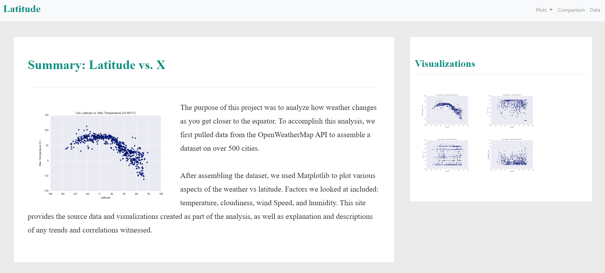
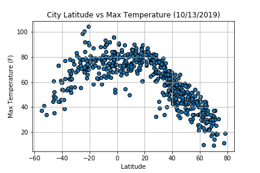
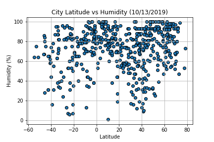
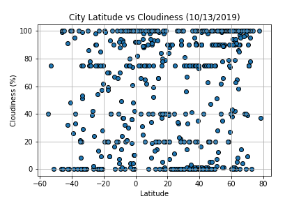

# Live Website:
Find live website [Here](https://limbz-sami.github.io/Web-Design-Challenge.github.io/cloud.html)

# What's the weather like as we approach the equator?
To prove it gets hotter as we approach equator, I visualized weather of more than 500 cities across the world of varying distance from the equator. To accomplish I this, I utilized OpenWeatherMap API and created a representative model of weather across world cities. 

# Method:
500 unique cities were selected based on latitude and longitude. Performed weather check on each cities using series of API calls. Printed log of each API calls and added the data into a dataframe. The dataframe was inspected and plotted.

I used series of scatterplots to show relationship between:
1) Temperature (F) vs. Latitude
2) Humidity (%) vs. Latitude
3) Cloudiness (%) vs. Latitude
4) Wind Speed (mph) vs. Latitude

# Tools:
Python, Pandas, Matplotlib, numPy, JSON data, Openweathermap API

# Directory direction:
Weatherpy consist of jupyter notebook and csv file. Data analysis was performed in jupyter notebook and data collected from API calls converted to csv file and saved. Figures directory consist of all the visualizations. 

# Observations:
 1) As expected latitude significantly impacted maximum temperature. The figure (latitude vs maxtemp) shows that the cities near equator have higher maximum temperature compared to the cities further away from equator.

2) On average, cities near equator seems to have higher humidity campared to cities away from equator. However, the pattern is not as clear as it is for maximum temperature. Significance of the data can be tested to verify the observation.

3) Latitude did not have impact on cloudiness % or wind_speed around the time the data was collected.

